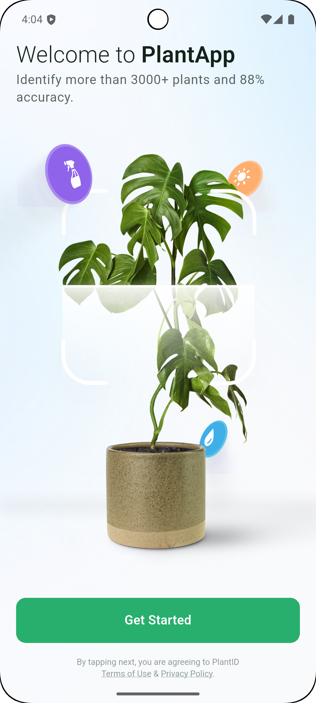
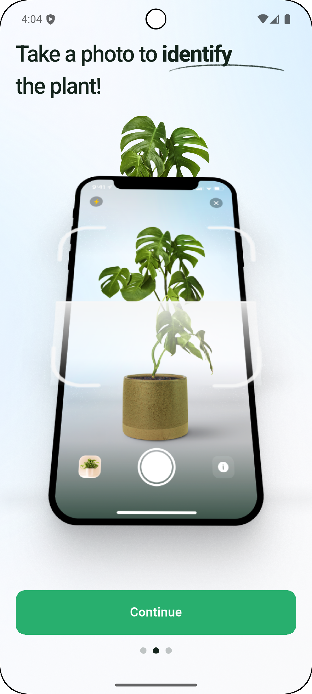
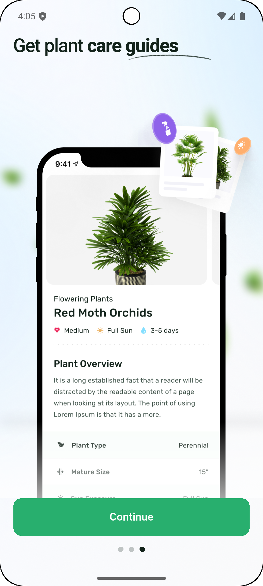
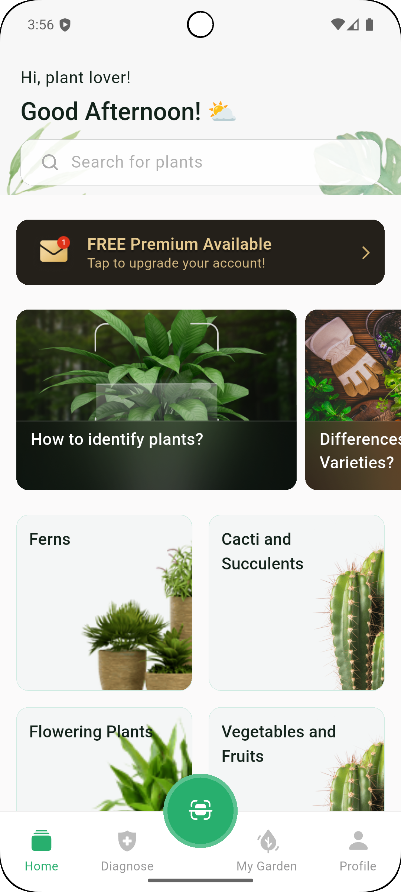
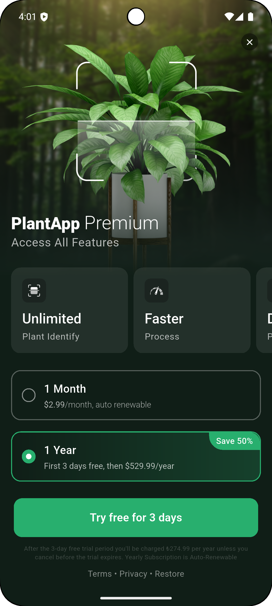

# 🌱 HubX Case - Flutter Proje Dokümantasyonu

## APK Dosyası
[Google Drive üzerinden indir](https://drive.google.com/file/d/1nLBOhxR-BMfrrzhitpRyTJ-qws5qKgwO/view?usp=drive_link)
## 📱 Uygulama Ekran Görüntüleri

### 🚀 Onboarding Akışı
Uygulamanın kullanıcı karşılama ve tanıtım akışını gösteren ekranlar:

<div align="center">
  
  <p>İlk karşılama ekranı - Uygulamanın ana değer önerisi</p>

  
  <p>İkinci tanıtım ekranı - Bitki bakım özelliklerinin açıklanması</p>

  
  <p>Üçüncü tanıtım ekranı - Foto çekme ve tanıma özelliği</p>
</div>

---

### 🏠 Ana Sayfa
Uygulamanın merkezi hub'ı olan ana sayfa:

<div align="center">
  
  <p>Ana sayfa - Kategoriler, sorular ve premium özellikler</p>
</div>

---

### 💎 Premium Paywall
Premium özelliklere erişim için tasarlanmış paywall ekranı:

<div align="center">
  
  <p>Premium özellikler ve abonelik planları</p>
</div>


---

## 📋 Proje Genel Bakış

**HubX Case**, modern Flutter teknolojileri kullanılarak geliştirilmiş, bitki tanıma ve bakım uygulamasıdır. Proje, Clean Architecture prensiplerine sadık kalarak, ölçeklenebilir ve sürdürülebilir bir kod yapısı sunmaktadır.

### 🎯 Ana Özellikler
- **Onboarding Flow**: Kullanıcı karşılama ve tanıtım akışı
- **Ana Sayfa**: Kategoriler ve sorular listesi
- **Premium Özellikler**: Paywall sistemi ile premium içerik erişimi
- **Çoklu Ekran Desteği**: Tablet ve telefon uyumlu responsive tasarım
---

## 🏗️ Teknik Mimari

### Clean Architecture Katmanları

#### 📁 **1. Domain Layer (İş Mantığı)**
```
lib/features/{feature}/domain/
├── entities/          # İş mantığı varlıkları
├── repository/        # Repository soyutlamaları  
└── usecases/         # İş mantığı kullanım senaryoları
```

**Özellikler:**
- İş mantığının framework'den bağımsız olması
- Entity'ler sadece iş kurallarını içerir
- Repository pattern ile veri kaynaklarından soyutlama
- UseCase pattern ile tek sorumluluk prensibi

#### 📁 **2. Data Layer (Veri Katmanı)**
```
lib/features/{feature}/data/
├── data_source/       # API ve local veri kaynakları
├── models/           # JSON serialization modelleri
└── repository/       # Repository implementasyonları
```

**Özellikler:**
- **JSON Serialization**: `json_annotation` ve `json_serializable` kullanımı
- **Code Generation**: Otomatik model generation ile `build_runner`
- **Immutable Models**: `copyWith()` desteği ve `Equatable` entegrasyonu
- **Type Safety**: Güçlü tip kontrolü ve null safety

#### 📁 **3. Presentation Layer (Sunum Katmanı)**
```
lib/features/{feature}/presentation/
├── blocs/            # BLoC state management
├── pages/            # Sayfa widget'ları
└── widgets/          # Yeniden kullanılabilir bileşenler
```

**Özellikler:**
- **BLoC Pattern**: `flutter_bloc` ile reaktif state management
- **Event-Driven**: Clear event/state separation
- **Dependency Injection**: `injectable` ve `get_it` entegrasyonu

---

## 🎨 UI/UX Gereksinimleri

### Material Design Implementation

#### **Responsive Design Stratejisi**
- **MediaQuery Kullanımı**: Ekran boyutlarına göre dinamik boyutlandırma
- **LayoutBuilder**: Widget'ların container'larına göre adapte olması
- **Flexible & Expanded**: Esnek alan paylaşımı
- **ScreenUtil Integration**: `flutter_screenutil` ile pixel-perfect tasarım

#### **Design System Architecture**
```
lib/core/design_system/theme/
├── hubx_colors.dart      # Renk paleti sistemi
├── hubx_fonts.dart       # Typography sistemi  
├── hubx_sizes.dart       # Boyut standartları
├── hubx_padding.dart     # Padding standartları
├── hubx_device.dart      # Device type detection
└── hubx_theme.dart       # Tema konfigürasyonları
```

**Öne Çıkan Özellikler:**
- **Device Type Detection**: Telefon/tablet otomatik algılama
- **Design Size Adaptation**: 393x852 (phone), 768x1024 (tablet)
- **Theme Support**: Light/Dark mode otomatik sistem desteği
- **Semantic Color Usage**: Anlamlı renk isimlendirmeleri

### Custom Widget Sistemi

#### **1. HubxButton**
- **Çoklu Konfigürasyon**: Background, gradient, border seçenekleri
- **Loading State**: Built-in loading indicator
- **Accessibility**: Semantic properties desteği
- **Flexible Sizing**: Width/height/padding kontrolü

#### **2. HubxImageWidget**
- **Multi-Source Support**: Network, asset, memory image desteği
- **Caching**: `cached_network_image` entegrasyonu  
- **Shimmer Loading**: Otomatik loading placeholder
- **Error Handling**: Fallback image sistemi

#### **3. HubxScaffold**
- **Navigation Integration**: `go_router` desteği
- **Customizable Structure**: AppBar, body, bottom navigation
- **Safe Area Management**: Platform-aware padding

#### **4. Shimmer Components**
- **ShimmerBox**: Çoklu boyut ve şekil desteği
- **Customizable Colors**: Base ve highlight renk kontrolü
- **Performance Optimized**: Hafif ve performanslı animasyonlar

---

## 🌐 Network Katmanı

### Dio HTTP Client Configuration

#### **Advanced Features**
- **Interceptors**: Request/response logging ve error handling
- **Timeout Management**: Connect, receive, send timeout'ları
- **Custom Headers**: JSON content-type ve accept headers
- **Error Handling**: Comprehensive exception management

#### **Exception Management Strategy**
```dart
NetworkExceptionHandler:
├── Connection Timeout     → User-friendly mesaj
├── HTTP Error Codes      → Detaylı hata analizi  
├── Network Unreachable   → Bağlantı durumu kontrolü
└── Custom API Errors     → API-specific error parsing
```

**Hata Yönetimi Özellikleri:**
- **Türkçe Hata Mesajları**: Kullanıcı dostu error handling
- **Status Code Mapping**: HTTP kodlarına göre özel mesajlar
- **Retry Logic**: Network hatalarında otomatik retry mekanizması
- **Offline Support**: İnternet bağlantısı kontrolü

### API Integration

#### **Endpoint Structure**
- **Categories API**: `https://dummy-api-jtg6bessta-ey.a.run.app/getCategoried`
- **Questions API**: `https://dummy-api-jtg6bessta-ey.a.run.app/getQuestions`

#### **Data Transformation Pipeline**
1. **Raw JSON Response** → API'den gelen ham veri
2. **Model Parsing** → `json_serializable` ile otomatik çevirme
3. **Entity Conversion** → Domain entity'lerine dönüştürme
4. **BLoC State Update** → UI'a reactive state güncelleme

---

## 🔄 State Management (BLoC Architecture)

### Event-Driven State Management

#### **Question Management**
```
QuestionBloc:
├── Events: LoadQuestionsEvent, RefreshQuestionsEvent
├── States: Initial, Loading, Loaded, Error, Refreshing
└── UseCase: GetQuestionsUseCase integration
```

#### **Category Management**  
```
CategoryBloc:
├── Events: LoadCategoriesEvent, RefreshCategoriesEvent
├── States: Initial, Loading, Loaded, Error, Refreshing
└── UseCase: GetCategoriesUseCase integration
```

**State Management Özellikleri:**
- **Immutable States**: `Equatable` ile state comparison
- **Event Separation**: Clear action/reaction ayrımı
- **Error Handling**: Dedicated error states
- **Loading States**: Multiple loading state variants
- **Refresh Logic**: Pull-to-refresh desteği

### Dependency Injection

#### **Injectable Configuration**
- **Singleton Services**: Dio, Navigation, Internet connection
- **Factory Instances**: BLoC'lar ve UseCase'ler
- **Module Registration**: Custom service registration
- **Code Generation**: Automatic DI container generation

---

## 🚀 Navigation ve Routing

### GoRouter Implementation

#### **Declarative Routing Structure**
```
App Routes:
├── /onboarding          → OnboardingPage
├── /paywall            → PaywallPage  
├── /home               → HomePage (with nested routes)
│   └── /search         → SearchPage
├── /diagnose           → DiagnosePage
├── /my-garden          → MyGardenPage
└── /profile            → ProfilePage
```

#### **Advanced Navigation Features**
- **StatefulShellRoute**: Bottom navigation ile nested routing
- **Route Guards**: Redirect logic ile access control
- **Page Transitions**: Custom transition animations
- **Deep Linking**: URL-based navigation support

### Bottom Navigation Architecture

#### **Center Floating Action Button**
- **Custom Positioning**: `FloatingActionButtonLocation.centerDocked`
- **Visual Hierarchy**: Scan butonu vurgusu
- **Accessibility**: Screen reader desteği
- **State Management**: Active tab indication

---

## 📱 Application Flows

### Onboarding Experience

#### **Multi-Step Introduction**
1. **Welcome Screen**: Ana karşılama ve value proposition
2. **Care Guide**: Bitki bakım özelliklerinin tanıtımı  
3. **Photo Recognition**: Foto çekme özelliğinin açıklanması

#### **State Persistence**
- **SharedPreferences**: Onboarding completion durumu
- **Route Logic**: İlk açılışta otomatik yönlendirme
- **Session Management**: Kullanıcı deneyimi sürekliliği

### Home Flow Architecture

#### **Content Sections**
- **Header**: Karşılama ve arama entegrasyonu
- **Premium Card**: Upgrade teşvik kartı
- **Questions Section**: API-driven dinamik içerik
- **Categories Section**: Kategori browsing sistemi

#### **Paywall Integration**
- **Timed Display**: 2 saniye sonra otomatik gösterim
- **Feature Showcase**: Premium özelliklerin tanıtımı
- **Subscription Plans**: Flexible pricing options
- **Close Handling**: User experience optimization

---

## 🧪 Test Mimarisi

### Test Kategorileri

#### **Unit Tests**
- **API Integration Tests**: Real endpoint testing
- **Model Serialization Tests**: JSON parsing validation  
- **Business Logic Tests**: UseCase functionality
- **State Management Tests**: BLoC behavior verification

#### **Widget Tests**
- **UI Component Tests**: Custom widget behavior
- **Integration Tests**: Multi-component interaction
- **Navigation Tests**: Route transition validation
- **Accessibility Tests**: Screen reader compatibility

#### **Test Implementation Details**
```
Test Coverage:
├── question_test.dart     → Questions API validation
├── category_test.dart     → Categories API validation
└── widget_test.dart       → Basic widget functionality
```

**Test Özellikleri:**
- **Real API Testing**: Production endpoint validation
- **Comprehensive Error Handling**: Exception scenario testing
- **Data Validation**: Model parsing ve serialization testing
- **Turkish Language Support**: Localized test messages

---

## ⚡ Performance Optimizations

### Memory Management

#### **Image Optimization**
- **Cached Network Image**: Automatic caching strategy
- **Memory Efficient Loading**: Progressive image loading
- **Placeholder Strategy**: Shimmer loading states
- **Error Fallback**: Graceful error handling

#### **Widget Performance**
- **Const Constructors**: Immutable widget optimization
- **Builder Patterns**: Selective widget rebuilding  
- **ListView Optimization**: Efficient scrolling performance
- **State Management**: Minimal rebuild strategies

### Network Performance

#### **Request Optimization**
- **Timeout Configuration**: Optimal timeout values
- **Connection Pooling**: Dio connection reuse
- **Compression**: JSON response optimization
- **Caching Strategy**: Response caching mechanisms

---

## 🌍 Internationalization & Accessibility

### Multi-Language Support

#### **Flutter Intl Integration**
- **ARB Files**: Structured localization files
- **Code Generation**: Automatic message generation
- **Context-Aware Translations**: Widget-specific translations
- **Plural Support**: Number-aware message formatting

### Accessibility Features

#### **Screen Reader Support**
- **Semantic Labels**: Meaningful widget descriptions
- **Focus Management**: Logical navigation order
- **Voice Over**: iOS accessibility integration
- **TalkBack**: Android accessibility support

#### **Visual Accessibility**
- **High Contrast**: Color accessibility compliance
- **Font Scaling**: Dynamic type support
- **Touch Targets**: Minimum 44px touch areas
- **Color Independence**: Non-color-dependent information

---

## 🔧 Development Tools & Quality

### Code Quality Standards

#### **Linting Rules**
- **Flutter Lints**: Recommended rule set activation
- **Custom Rules**: Project-specific guidelines
- **Formatter Configuration**: 150 character line width
- **Trailing Commas**: Preserved for better diffs

#### **Code Generation Tools**
- **Build Runner**: Model generation automation
- **Asset Generation**: Type-safe asset references
- **Injection Generation**: DI container automation
- **Localization Generation**: Translation file processing

### Git Workflow

#### **Branching Strategy**
- **Feature Branches**: Isolated feature development
- **Develop Branch**: Integration branch
- **Semantic Commits**: Conventional commit format
- **PR Review**: Code quality assurance

#### **Commit Message Convention**
```
feat: onboarding screen implementation
fix: network timeout handling
docs: API documentation update  
refactor: widget structure optimization
test: unit test coverage improvement
```

---


## 🏆 Bonus Özellikler

### Advanced Features

#### **Performance Monitoring**
- **Custom Logger**: Detailed network request/response logging
- **Memory Profiling**: Widget lifecycle monitoring
- **Network Profiling**: API response time tracking
- **Crash Reporting**: Production error tracking

#### **User Experience Enhancements**
- **Haptic Feedback**: Touch response optimization
- **Animation System**: Smooth page transitions
- **Loading States**: Contextual loading indicators
- **Error Recovery**: Graceful error handling with retry options

#### **Developer Experience**
- **Hot Reload**: Fast development iteration
- **Code Generation**: Reduced boilerplate code
- **Type Safety**: Compile-time error prevention
- **Documentation**: Comprehensive inline documentation

---

## 📊 Project Metrics

### Code Organization
- **Clean Architecture**: 3-layer separation (Domain, Data, Presentation)
- **Feature-Based Structure**: Modular organization
- **Reusable Components**: 5+ custom widget library
- **Test Coverage**: API integration ve core functionality

### Technical Compliance
- **✅ Material Design**: Complete implementation
- **✅ Responsive Design**: Multi-device support
- **✅ BLoC Pattern**: Reactive state management
- **✅ Clean Architecture**: SOLID principles
- **✅ JSON Serialization**: Type-safe data handling
- **✅ Network Layer**: Production-ready HTTP client
- **✅ Onboarding Flow**: Complete user journey
- **✅ Navigation**: Declarative routing system
- **✅ Theme System**: Light/dark mode support
- **✅ Code Quality**: Linting ve analysis

---

## 🎯 Sonuç

HubX Case projesi, modern Flutter development best practice'lerini kapsamlı bir şekilde uygulayan, ölçeklenebilir ve sürdürülebilir bir mobil uygulama örneğidir. Clean Architecture prensiplerine sadık kalarak geliştirilmiş olan proje, hem teknik mükemmellik hem de kullanıcı deneyimi açısından yüksek standartları karşılamaktadır.

**Projenin güçlü yönleri:**
- Kapsamlı mimari tasarım ve implementasyon
- Production-ready code quality ve standards
- Comprehensive error handling ve user experience
- Modern Flutter teknolojilerinin etkin kullanımı
- Responsive design ve accessibility compliance
- Test-driven development approach

Bu dokümantasyon, projenin her aspectini detaylandırarak, geliştiricilerin ve değerlendiricilerin projeyi tam olarak anlayabilmesini sağlamaktadır. 
